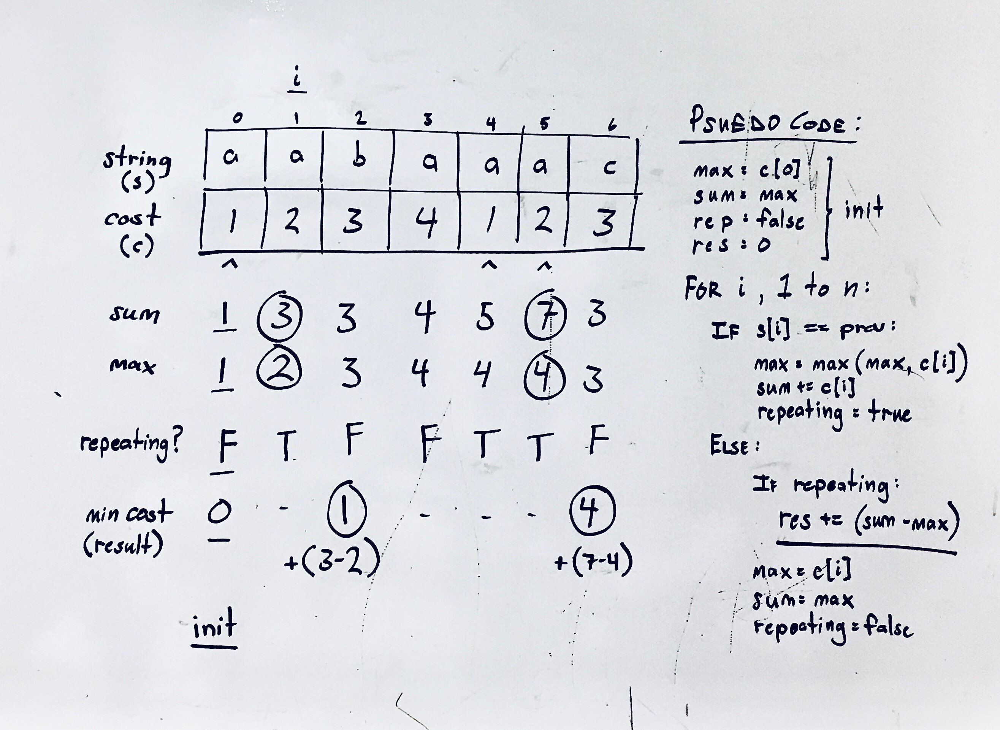

## Min cost of deleting repeating letters in string

### Problem

Given a string s and an array of integers cost where cost[i] is the cost of deleting the ith character in s. Return the minimum cost of deletions such that there are no two identical letters next to each other. Notice that you will delete the chosen characters at the same time, in other words, after deleting a character, the costs of deleting other characters will not change.

source: Minimum Deletion Cost to Avoid Repeating Letters (lc 1578) - https://leetcode.com/problems/minimum-deletion-cost-to-avoid-repeating-letters/

### Design

Intuition: For a given run of repeating letters, delete all but the one with max cost, ie when repeating run ends, add to result the cumulative sum of costs of all repeating letters minus the cost of max.



### Analysis

time: O(n)
space: O(1)

### Implementation

```javascript
var minCost = function(s, cost) {

  let res = 0,
      max = cost[0], // max cost of repeating letters
      sum = max,     // cumulative sum of repeating letters
      rep = false;   // is repeating?

  for (let i = 1; i <= s.length; i++) {

      if (s[i] === s[i-1]) { // repeating
          max = Math.max(max, cost[i]);
          sum += cost[i];
          rep = true;

      } else { // not repeating
          if (rep)
              res += (sum - max);

          if (i < s.length) {
              max = cost[i];
              sum = max;
              rep = false;
          }
      }
  }

  return res;
};
```
(from [javascript/min_cost_of_deleting_repeating.js](../../javascript/min_cost_of_deleting_repeating.js))

more concise solution: https://leetcode.com/problems/minimum-deletion-cost-to-avoid-repeating-letters/discuss/864460/Easiest-JS-Solution
