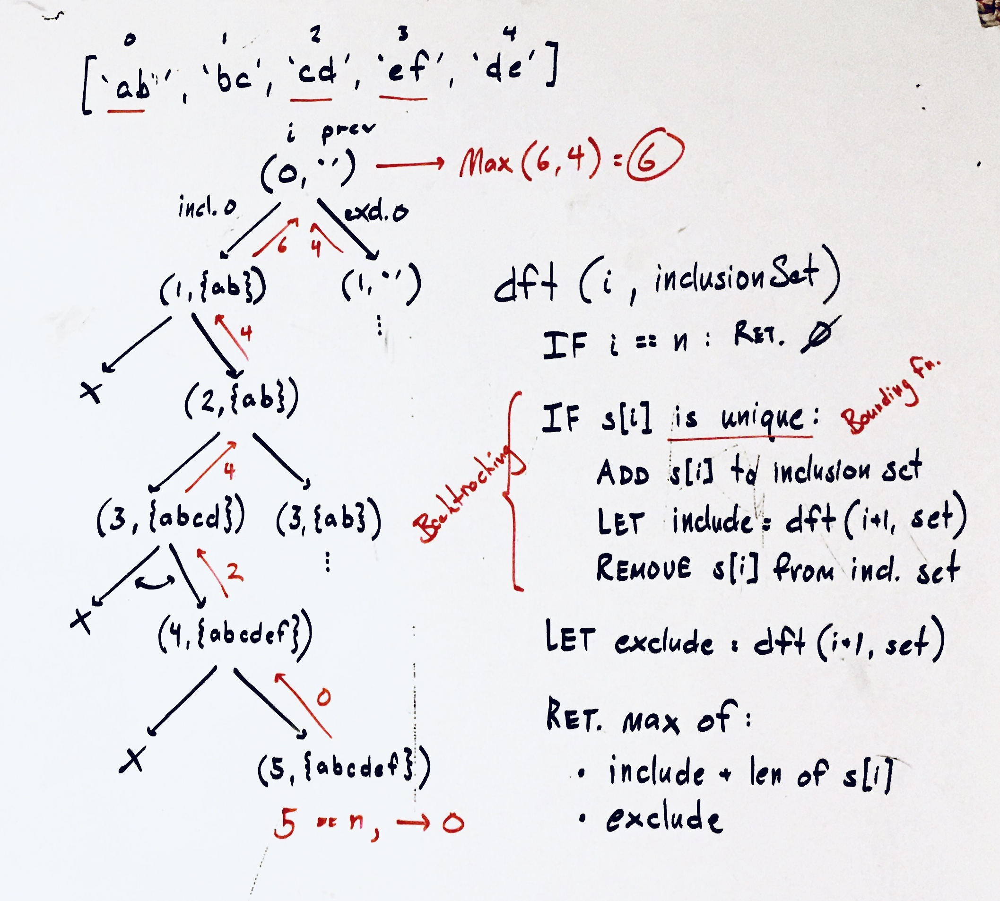

## XXX

### Problem

xxx

source: xxx

### Design



### Analysis

Time: O(x)
Space: O(x)

### Implementation

Javascript implementation...

```javascript
/**
 * @param {string[]} arr
 * @return {number}
 */
var maxLength = function(arr) {
  function _dft(i, set = new Set()) {
      if (i === arr.length) return 0;

      // try including i
      let include = -Infinity;
      if (uniq(set, arr[i])) {
          union(set, arr[i]);
          include = _dft(i+1, set);
          diff(set, arr[i]);
      }

      // try excluding i
      let exclude = _dft(i+1, set);

      // take best
      return Math.max(exclude, include + arr[i].length)
  };

  return _dft(0);
};

const union = (set, str) => {
  for (let c of str) set.add(c)
}
const diff = (set, str) => {
  for (let c of str) set.delete(c)
}
const uniq = (set, str) => {
  let seen = new Set();
  for (let c of str) {
      if (set.has(c) || seen.has(c)) return false;
      seen.add(c);
  }
  return true;
}
```
(from [max_unique_subsequence_of_strings.js](../../javascript/recursion_and_dynamic/max_unique_subsequence_of_strings.js))
