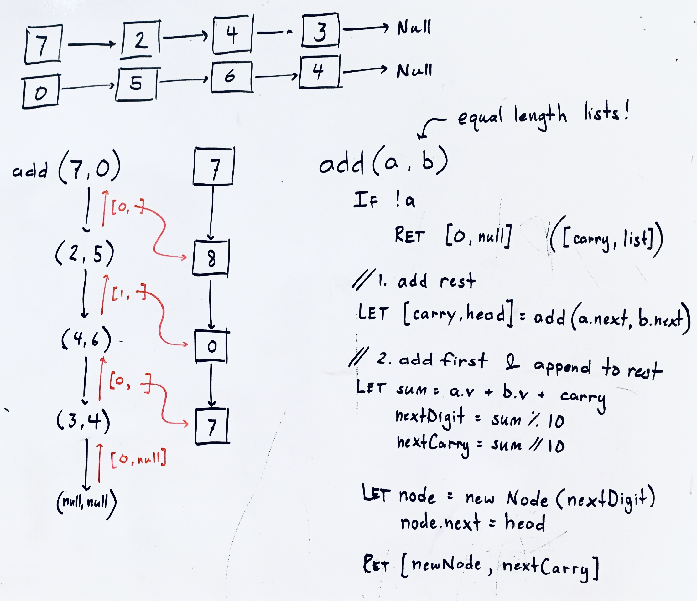

## sum numbers represented as linked lists

### Problem

You are given two non-empty linked lists representing two non-negative integers. The most significant digit comes first and each of their nodes contains a single digit. Add the two numbers and return the sum as a linked list. You may assume the two numbers do not contain any leading zero, except the number 0 itself.

source: Add two numbers II (lc 445) - https://leetcode.com/problems/add-two-numbers-ii/

### Design



### Analysis

Time: O(n) - visit each pair of nodes in parallel
Space: O(n) - for recursive call stack

### Implementation

Javascript implementation...

```javascript
function add(n1, n2) { // post-order list traversal; requires equal length lists

  if (!n1 && !n2) return [null, 0]

  // 1. add rest of digits (excluding first)
  let [head, carry] = add(n1.next,n2.next);

  // 2. add first digits + carry
  let sum = n1.val + n2.val + carry,
      nextDigit = sum % 10;
      nextCarry = Math.floor(sum/10),
      nextHead = new ListNode(nextDigit);

  // 3. append first to rest
  nextHead.next = head;

  return [nextHead, nextCarry];
}
```
(from [sum_lists.js](../../javascript/linked_lists/sum_lists.js))
