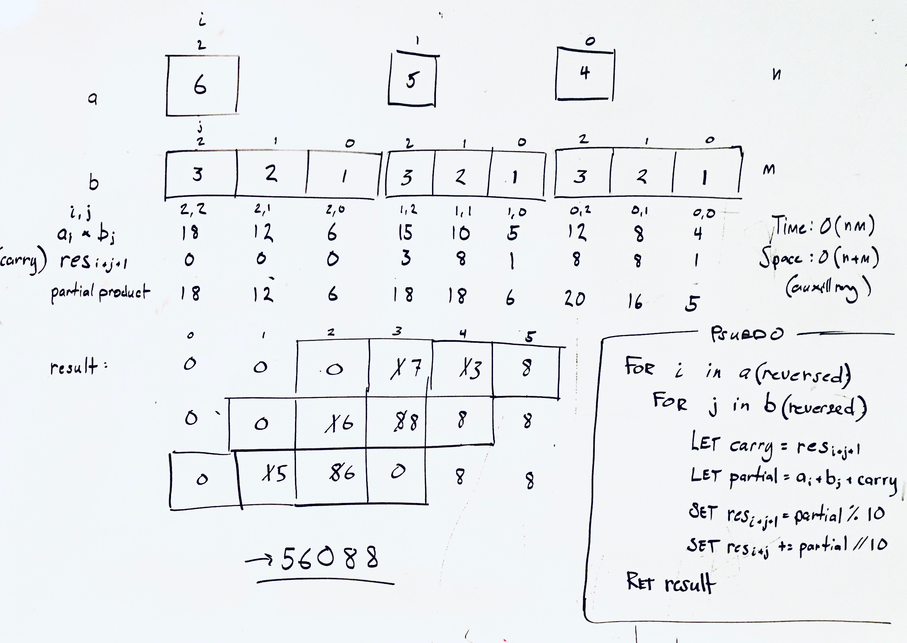

## Multiple the string representations of two integers

### Problem

Given two non-negative integers a and b represented as strings, return the product of a and b, also represented as a string.

source: Multiply Strings (lc 43) - https://leetcode.com/problems/multiply-strings/

### Design



### Analysis

* Time: O(nm) - nested for loop
* Space: O(n+m) - aux array of size n + m

### Implementation

**Javascript:**

```javascript
var multiply = function(a, b) {
  if (a === '0' || b === '0') return '0';

  // length of product will be the sum of lengths of factors (-1)
  let res = Array(a.length + b.length).fill(0);

  for (let i = a.length - 1; i >= 0 ; i--) {
      for (let j = b.length - 1; j >= 0; j--) {

          // calc partial product
          let carry = res[i+j+1];
          let partial = a[i] * b[j] + carry;

          // update result
          res[i+j+1] = partial % 10;
          res[i+j] += Math.floor(partial/10); // next carry
      }
  }

  return (res[0] === 0)
      ? res.slice(1).join('') // leading zero
      : res.join('')
};
```
(from [multiply_string_representations.js](../../javascript/math/multiply_string_representations.js))


