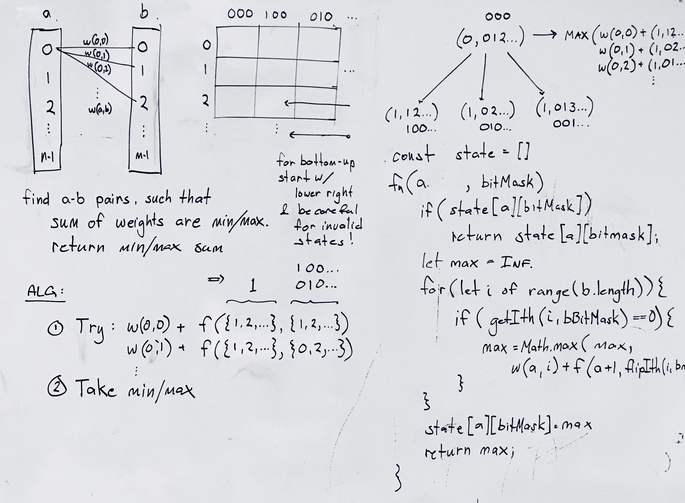

## Minimum Weighted Sum (e.g. Campus Bikes Problem)

### Problem

On a campus represented as a 2D grid, there are N workers and M bikes, with N <= M. Each worker and bike is a 2D coordinate on this grid. We assign one unique bike to each worker so that the sum of the Manhattan distances between each worker and their assigned bike is minimized. The Manhattan distance between two points p1 and p2 is Manhattan(p1, p2) = |p1.x - p2.x| + |p1.y - p2.y|. Return the minimum possible sum of Manhattan distances between each worker and their assigned bike.

Constraints:

```
N == workers.length
M == bikes.length
1 <= N <= M <= 10
workers[i].length == 2
bikes[i].length == 2
0 <= workers[i][0], workers[i][1], bikes[i][0], bikes[i][1] < 1000
All the workers and the bikes locations are unique.
```

source: Campus Bikes II (lc 1066) - https://leetcode.com/problems/campus-bikes-ii/

### Design



### Analysis

Time: O(n*2^m) - time to build dp table
Space: O(n*2^m) - size of dp table

### Implementation

Javascript implementation of top-down dp solution.

```js
var assignBikes = function(workers, bikes) {
  const m = bikes.length;
  const n = workers.length;

  // pre-calc distances
  ...

  // build dp table top-down
  const table = [...Array(n)].map(row => Array(2**m).fill(null));
  const dp = (wi, bikeState) => {

    if (wi == n) return 0;
    if (table[wi][bikeState]) return table[wi][bikeState];

    for (let bi = 0; bi < m; bi++) {
      if (getBit(bikeState, bi) == 0) {
        table[wi][bikeState] = Math.min(
          table[wi][bikeState] || Infinity,
          distances[wi][bi] + dp(wi+1, setBit(bikeState, bi))
        )
      }
    }

    return table[wi][bikeState];
  }

  return dp(0, 0);
};
```
(see [full implementation](../../javascript/searching_and_sorting/campus_bikes_2.js))
