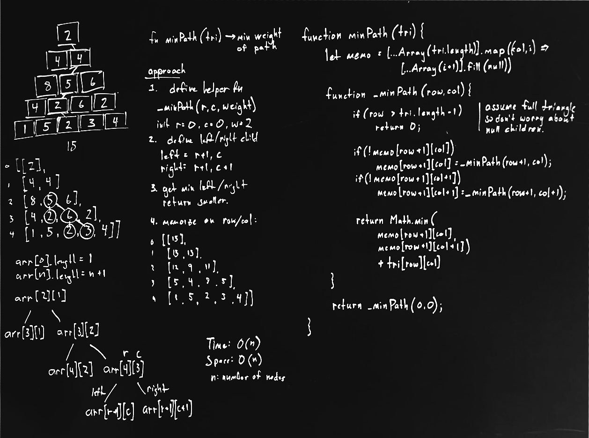

 ## Find the weight of the minimum path in triangle.

### Problem

Define a path in the triangle to be a sequence of entries in the triangle in which 
adjacent entries in the sequence correstpond to entries that are adjacent in the 
triangle. The path must start at the top, descend the triangle continuously, and 
end with an entry on the bottom row. The weight of a path is the sum of the entries. 
Write a progarm that takes as input a triangle of numbers and retunrn the weight 
of a  minimum weight path.

source: EPI 16.8

### Boardwork (Design)



### Analysis

Time: O(n)
Space: O(n)

Can further optimize for space by pre-calculating triangle breadth-first and 
reusing storages for each subsequent level in triangle. However, there are n/2
nodes in full binary tree of size n, so space complexity will still be O(n).

### Codework (Test)

Javascript implementation of in-place solution.

```javascript
function minPath(tri) {
    let memo = [...Array(tri.length + 1)]
        .map((_, i) => [...Array(i+1).fill(null)]);

    function _minPath(row,col){
        if(row > tri.length - 1)
            return 0;

        // update cache
        if(!memo[row+1][col])
            memo[row+1][col] = _minPath(row+1,col);
        if(!memo[row+1][col+1])
            memo[row+1][col+1] =_minPath(row+1,col+1);

        // return weight of min path from bottom up to current node
        return Math.min(
            memo[row+1][col], 
            memo[row+1][col+1]
            ) + tri[row][col]  
    }
    return _minPath(0,0);
}
```
(see [min_path_in_triangle.js](../../javascript/recursion_and_dynamic/min_path_in_triangle.js))


