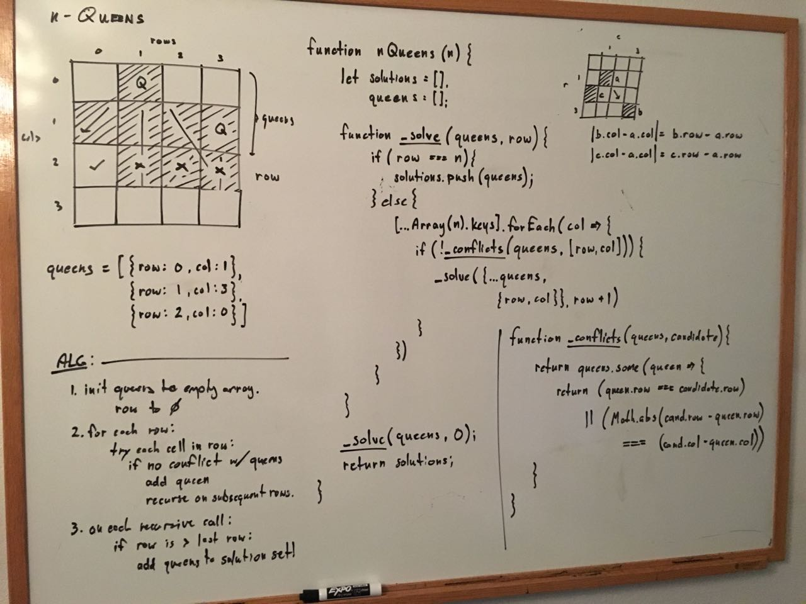

## n Queens problem

### Problem

Write a program which returns all distinct non-attacking placements 
of n queens on a n x n chessboard, where n is an input to the program.

source: EPI 15.2

### Boardwork (Design)



### Analysis

1. Loop thru rows 0 to n - 1.
2. Try placing a queen at each position in row. 
3. recurse on every try that does not conflict (with queens on preceeding rows).

Time: O(x)
Space: O(x)

### Codework (Test)

Javascript implementation.

```javascript
function nQueens(n) {

    let solutions = [];

    // check for *any* conflicts with queens on preceeding rows
    function _conflicts(queens, candidate) {
        return queens.some(queen => (
            ( queen.col === candidate.col ) || 
            ( Math.abs(candidate.col - queen.col) === (candidate.row - queen.row) )
        ))
    }

    // solve for remaining rows, row to n-1, given queens on preceeding rows.
    function _solve(queens, row) {
        if ( row === n ) {
            // found solution!
            solutions.push(queens);
        } else {
            // try queen at each position in this row
            [...Array(n).keys()].forEach(col => {
                if ( !_conflicts(queens, {row, col}) ) {
                    _solve([...queens, {row, col}], row + 1);
                } 
            })
            // try no queens in this row
            _solve(queens, row + 1);
        }
    }

    _solve([], 0);
    return solutions;
}
```
(from [n_queens.js](../../javascript/recursion_and_dynamic/n_queens.js))