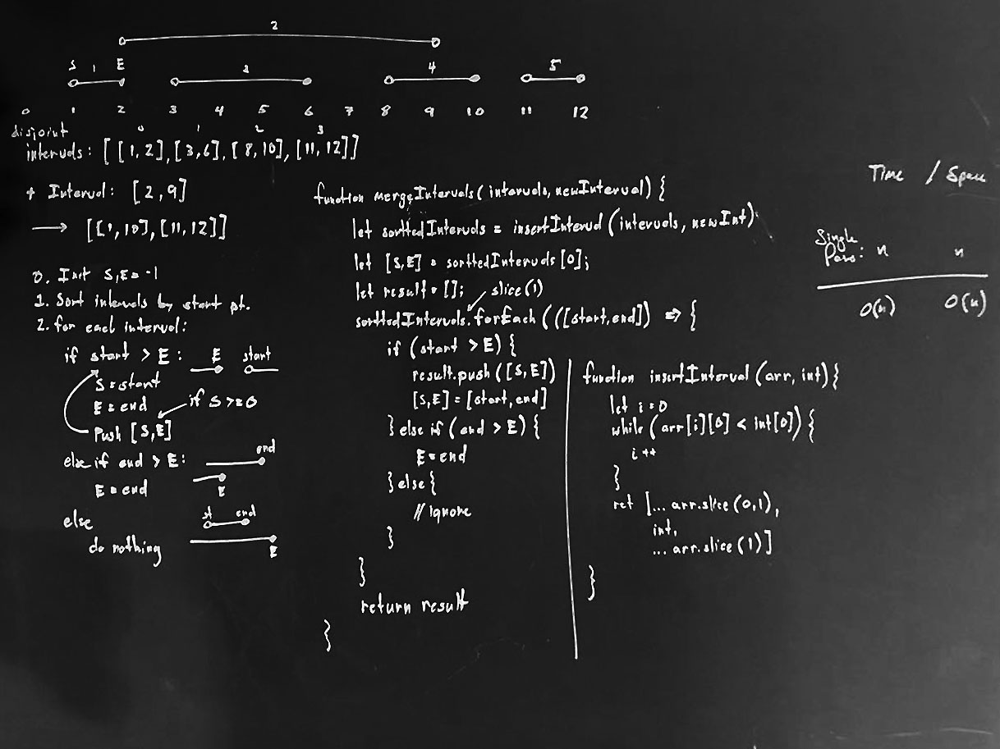

# Searching and Sorting

## 1. Add Interval

### Problem

write a program which takes as input an array of disjoint closed interval withinterger 
endpoints, sorted by ncreasing order of left endpoint, an dan interval to be added, and 
returns that union of the intervales in the array and the added interval. Your result
should be expressed as an union of disjoint intervals sorted by left endpoint.

source: EPI 13.6

### Boardwork (Design)


<!--  -->

### Analysis

xxx

### Codework (Test)

Javascript implementation.

```javascript
const insertInterval = (intervals, toInsert) => {
    let i = 0;
    while (i < intervals.length && intervals[i][0] < toInsert[0]) 
        i++;
    return [
        ...intervals.slice(0,i), 
        toInsert,
        ...intervals.slice(i)
    ];
}

const addInterval = (intervals, toAdd) => {
    intervals = insertInterval(intervals, toAdd);
    let [s,e] = intervals[0];
    let result = [];
    intervals.slice(1).forEach( ([start,end]) => {
        if (start > e) {
            result.push([s,e]);
            [s,e] = [start,end];
        } else if (end > e) {
            e = end;
        } else {
            // skip
        }
    })
    result.push([s,e]);
    return result;
}
```


