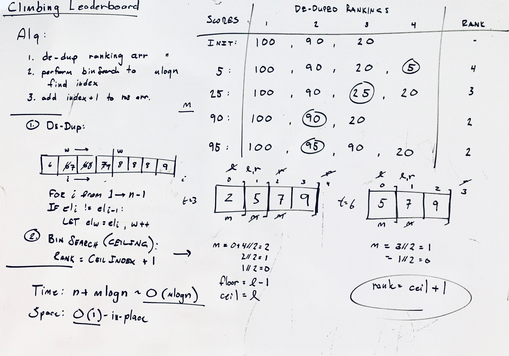

## XXX

### Problem

An arcade game player wants to climb to the top of the leaderboard and track their ranking. The game uses Dense Ranking, so its leaderboard works like this: The player with the highest score is ranked number  on the leaderboard. Players who have equal scores receive the same ranking number, and the next player(s) receive the immediately following ranking number.

source: Climbing the leaderboard (hr) - https://www.hackerrank.com/challenges/climbing-the-leaderboard

### Design



### Analysis

* Time: O(mlogn) - perform bin search in ranking array (size n), for each of m scores
* Space: O(1) - in-place de-dup, aux space only (not incl. result array)

### Implementation

Javascript implementation...

```javascript
function climbingLeaderboard(scores, alice) {

  let [n,m] = [scores.length, alice.length];

  // 1. de-dup rankings
  let write = 1;
  for (let i = 1; i < n; i++) {
      if (scores[i] != scores[i-1]) {
          scores[write] = scores[i]
          write++;
      }
  }

  // 2. find ranking for each score via bin search
  let result = [];
  for (let i = 0; i < m; i++) {
      let newRank = binSearch(scores, alice[i], 0, write) + 1; // rank = ceil + 1
      result.push(newRank);
  }

  return result;
}

// returns ceiling index
function binSearch(arr, target, left, right) {

  while (left < right) {
      let mid = left + Math.floor((right - left)/2);

      if (arr[mid] === target) {
          return mid;
      } else if (arr[mid] < target) {
          right = mid;
      } else {
          left = mid + 1;
      }
  }

  return left;
}
```
(from [xxx](../../javascript/xxx))
