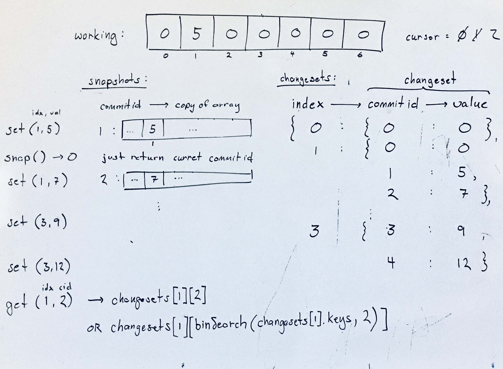

## Snapshot Array

### Problem

Implement a SnapshotArray that supports the following interface:

SnapshotArray(int length) initializes an array-like data structure with the given length.  Initially, each element equals 0.
void set(index, val) sets the element at the given index to be equal to val.
int snap() takes a snapshot of the array and returns the snap_id: the total number of times we called snap() minus 1.
int get(index, snap_id) returns the value at the given index, at the time we took the snapshot with the given snap_id

source: Snapshot Array (leetcode 1146) - https://leetcode.com/problems/snapshot-array/

### Design



### Analysis

Time: O(x)
Space: O(x)

### Implementation

Javascript implementation using changesets.

```javascript
var SnapshotArray = function(length) {
  this.cursor = 0;       // next commit id
  this.changesets = {};  // index -> { commit id -> val }

  // initialize array to zeros
  for (let idx of [...Array(length).keys()]) {
      this.changesets[idx] = {'0':0}
  }
};

SnapshotArray.prototype = {

  set(index, val) {
    this.changesets[index][this.cursor] = val; // overwrite previous since last commit
  },

  snap() {
    return this.cursor++; // each call to snap results in unique id even if no changes have been made
  },

  get(index, sid) {
    let changeset = this.changesets[index];

    // if change logged for sid, use it
    if (sid in changeset) {
      return changeset[sid];
    }

    // else, find most recent change (before sid)
    let sids = Object.keys(changeset)
    let closest = floorBinSearch(sids, sid, 0, sids.length); // return value not index
    
    return changeset[closest];
  }
}
```
(see [full implementation](./../../javascript/searching_and_sorting/snapshot_array.js))