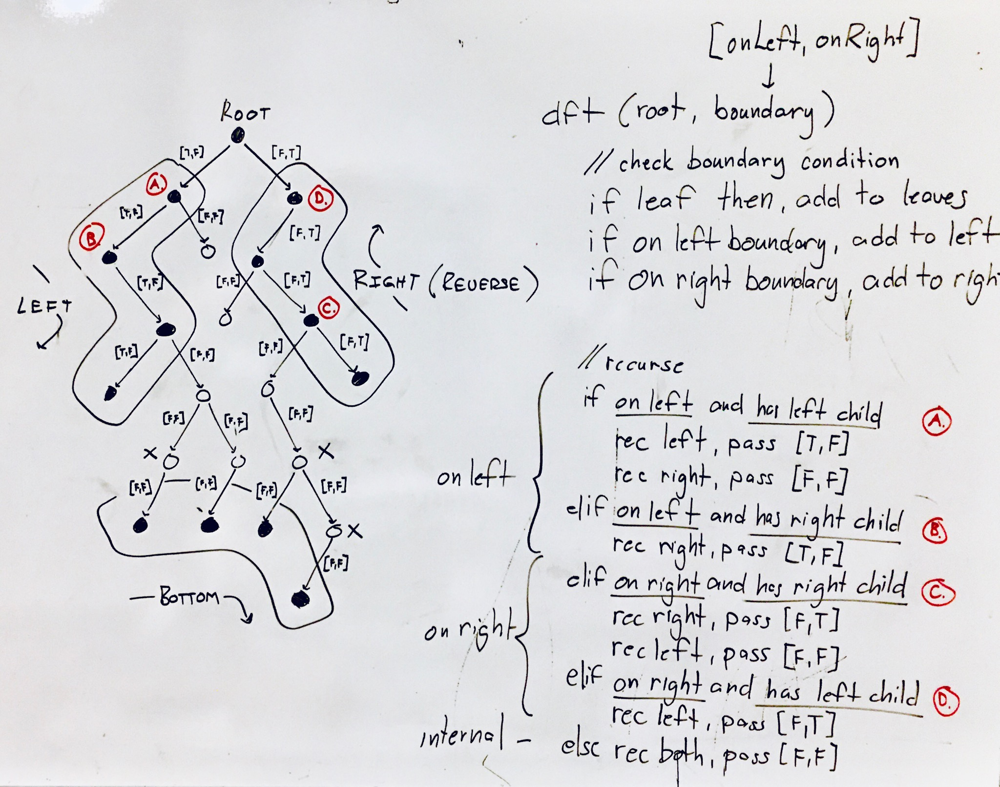

## Boundary of Binary Tree

### Problem

xxx

source: xxx

### Design



### Analysis

Time: O(n) - visit every node
Space: O(n) - upper bound of call stack

### Implementation

Javascript implementation...

```javascript
/**
 * @param {TreeNode} root
 * @return {number[]}
 */
var boundaryOfBinaryTree = function(root) {
  let left = [], right = [], bottom = [];

  function dft(root, [onLeft, onRight]) {
    if (!root) return;

    // check for leaves
    if (!root.left && !root.right) {
      bottom.push(root.val);
      return;
    }

    // check for boundary
    if (onLeft) left.push(root.val);
    if (onRight) right.push(root.val);

    // a. on left boundary
    if (onLeft && root.left) {
        dft(root.left, [true, false]);
        dft(root.right, [false, false]);
    } else if (onLeft && root.right) {
        dft(root.right, [true, false]);

    // b. on right boundary
    } else if (onRight && root.right) {
      dft(root.left, [false, false]);
      dft(root.right, [false, true]);
    } else if (onRight && root.left) {
      dft(root.left, [false, true]);

    // c. internal node
    } else {
        dft(root.left, [false, false]);
        dft(root.right, [false, false]);
    }
  }

  dft(root.left, [true, false]);
  dft(root.right, [false, true]);

  return [root.val].concat(left, bottom, right.reverse());
};
```
(from [xxx](../../javascript/xxx))
