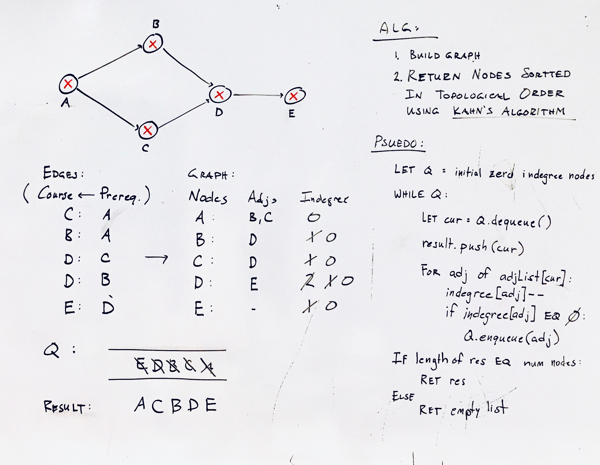

## Course Schedule

### Problem

There are a total of numCourses courses you have to take, labeled from 0 to numCourses - 1. You are given an array prerequisites where prerequisites[i] = [ai, bi] indicates that you must take course bi first if you want to take course ai. For example, the pair [0, 1], indicates that to take course 0 you have to first take course 1.

Return true if you can finish all courses. Otherwise, return false.

Alt: Return the ordering of courses you should take to finish all courses. If there are many valid answers, return any of them. If it is impossible to finish all courses, return an empty array.

source: course-schedule (leetcode 207/210) - https://leetcode.com/problems/course-schedule, https://leetcode.com/problems/course-schedule-ii/

### Design



### Analysis

* **Time:** O(V + E) where V represents the number of vertices and E represents the number of edges. We pop each node exactly once from the zero in-degree queue and that gives us V. Also, for each vertex, we iterate over its adjacency list and in totality, we iterate over all the edges in the graph which gives us E. Hence, O(V + E)

* **Space:** O(V + E). We use an intermediate queue data structure to keep all the nodes with 0 in-degree. In the worst case, there won't be any prerequisite relationship and the queue will contain all the vertices initially since all of them will have 0 in-degree. That gives us O(V). Additionally, we also use the adjacency list to represent our graph initially. The space occupied is defined by the number of edges because for each node as the key, we have all its adjacent nodes in the form of a list as the value. Hence, O(E). So, the overall space complexity is O(V + E).

(source: https://leetcode.com/problems/course-schedule-ii/solution/)

### Implementation

Javascript

```js
var canFinish = function(numCourses, prerequisites) {
    let adjMap = [...Array(numCourses)].map(x=>[]),
        indegree = Array(numCourses).fill(0);

    // build graph
    for(const [to, from] of prerequisites){
        adjMap[from].push(to);
        indegree[to]++;
    }

    // implement Kahn's Algorithm
    let removed = []; // topo sorted nodes
    let q =[];

    // 1. add zero indegree nodes to q
    for (let i = 0; i < indegree.length; i++) {
        if (indegree[i] == 0) q.push(i)
    }

    // 2. while zero-indegree nodes left to process:
    //    remove node, update indegrees and add new zero indegree nodes to q
    while(q.length){
        let cur = q.shift();

        removed.push(cur);

        for(let adj of adjMap[cur]){
            indegree[adj]--;
            if(!indegree[adj]){
                q.push(adj);
            }
        }
    }

    // 3. if processed all nodes, there are no cycles
    return removed.length === numCourses;
    // return (removed.length == numCourses) ? removed : [];
};
```
(from [course_schedule.js](../../javascript/course_schedule.js))


