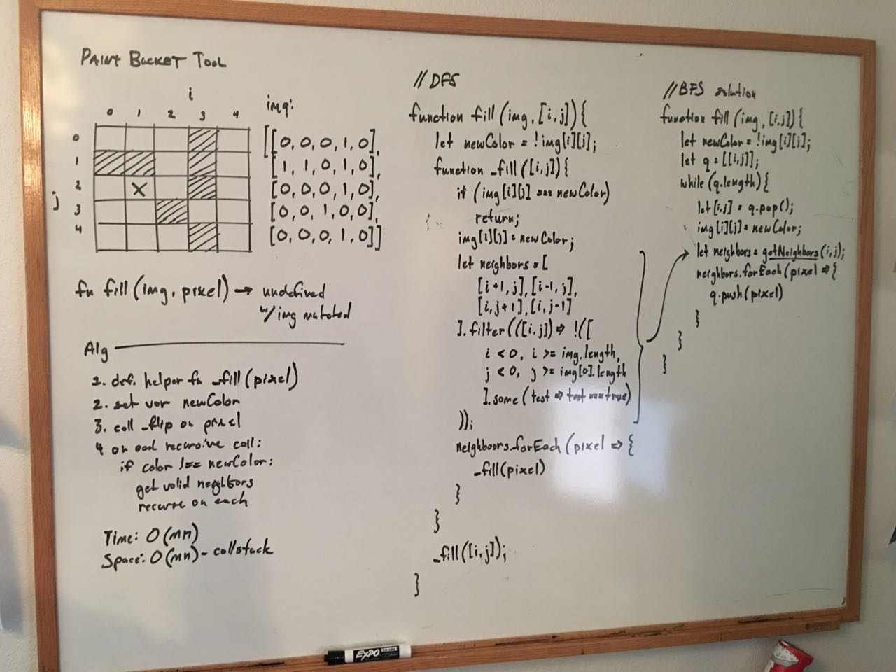

## Paint bucket fill tool

### Problem

Implement a function that takes an n x m Boolean array and a pixel
(i, j) and flips the color of the region associated with (i, j), where
a region is all points, such that there exists a path from (i,j)
to each point in region by traversing adjacent pixels.

source: adapted from EPI 18.2 Paint a Boolean Matrix

### Design



### Analysis

Time: O(mn)
Space: O(mn)

### Implementation

Helper functions.

```javascript
const outOfBounds = (grid, r, c) => {
    return [
        r < 0, r >= grid.length,
        c < 0, c >= grid[0].length
    ].some(test => test)
}

const getNeighbors = (grid, r, c) => {
    return [
        [r + 1, c],
        [r - 1, c],
        [r, c + 1],
        [r, c - 1]
    ].filter(([r, c]) => !outOfBounds(grid, r, c))
}
```
(from [paint_bucket.js](../../javascript/trees_and_graphs/paint_bucket.js))

DFS solution.

```javascript
function fill(img, i, j) {

    let newColor = img[i][j] ? 0 : 1;

    function _fill(i,j) {

        if (img[i][j] !== newColor) {
            img[i][j] = newColor;

            let neighbors = getNeighbors(img, i, j);
            neighbors.forEach(pixel => {
                _fill(...pixel)
            })
        }
    }

    _fill(i,j);
}
```
(from [paint_bucket.js](../../javascript/trees_and_graphs/paint_bucket.js))

BFS Solution.

```javascript
function fill2(img, i, j) {

    let newColor = img[i][j] ? 0 : 1;
    let q = [[i,j]];

    while(q.length) {
        let [i, j] = q.pop();
        img[i][j] = newColor;
        let neighbors = getNeighbors(img, i, j);
        neighbors.forEach(([i, j]) => {
            if (img[i][j] !== newColor) {
                q.push([i, j])
            }
        })
    }
}
```
(from [paint_bucket.js](../../javascript/trees_and_graphs/paint_bucket.js))

### Demo

<iframe width="100%" height="834" frameborder="0"
  src="https://observablehq.com/embed/76789f6c016bee21?cells=simple_paint_bucket"></iframe>
