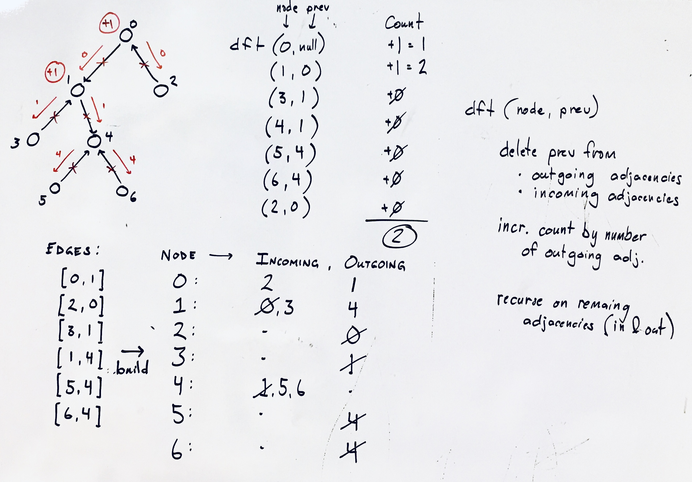

## Reorder routes

### Problem

There are n cities numbered from 0 to n-1 and n-1 roads such that there is only one way to travel between two different cities (this network form a tree). Last year, The ministry of transport decided to orient the roads in one direction because they are too narrow. Roads are represented by connections where connections[i] = [a, b] represents a road from city a to b. This year, there will be a big event in the capital (city 0), and many people want to travel to this city. Your task consists of reorienting some roads such that each city can visit the city 0. Return the minimum number of edges changed. It's guaranteed that each city can reach the city 0 after reorder.

source: Reorder Routes to Make All Paths Lead to the City Zero (lc 1466) - https://leetcode.com/problems/reorder-routes-to-make-all-paths-lead-to-the-city-zero/

### Design



### Analysis

Time: O(x)
Space: O(x)

### Implementation

Javascript

```javascript
/**
 * @param {number} n
 * @param {number[][]} connections
 * @return {number}
 */
var minReorder = function(n, connections) {
    const outgoing = [...Array(n)].map(_ => new Set());
    const incoming = [...Array(n)].map(_ => new Set());

    for (let [u,v] of connections) {
        outgoing[u].add(v);
        incoming[v].add(u);
    }

    let cnt = 0;
    function dft(node, caller=null) {

        // remove caller
        outgoing[node].delete(caller);
        incoming[node].delete(caller);

        // incr count by number of outgoing connections
        cnt += outgoing[node].size;

        // recurse on incoming and outgoing neighbors
        for (let inc of incoming[node]) dft(inc, node);
        for (let out of outgoing[node]) dft(out, node);
    }

    dft(0);
    return cnt;
};
```
(from [xxx](../../javascript/xxx))
