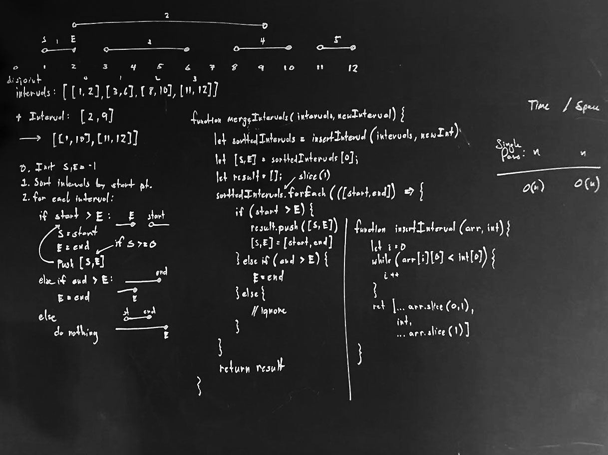
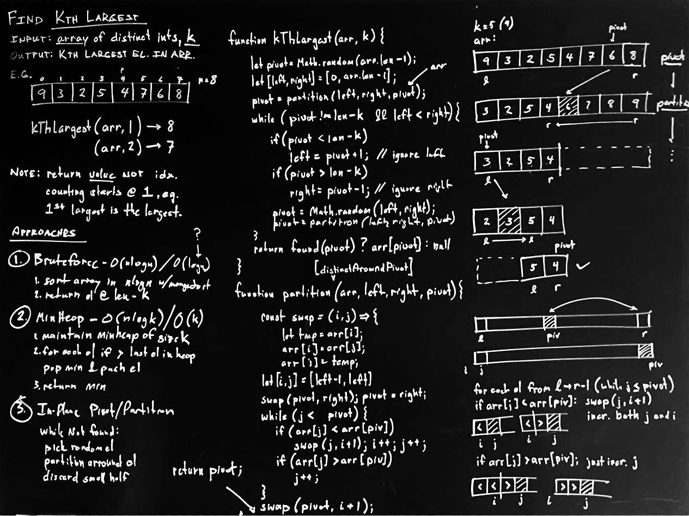
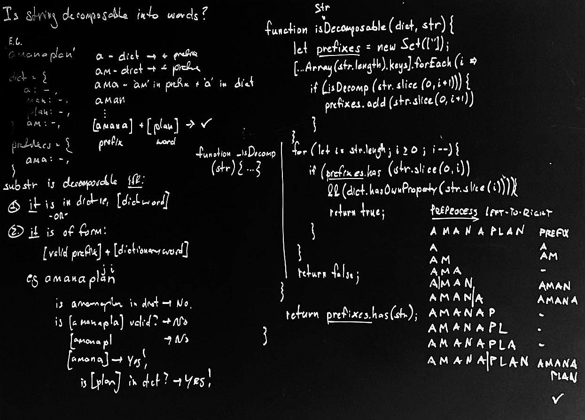

# Algorithms

### Searching and Sorting

 

### Recursion and Dynamic Programming

 

### Heaps

 

---

EPI - Elements of Programming Interviews
CTCI - Cracking the Coding Interview
AE - AlgoExpert
LC - LeetCode (Top 100 Interview Questions

